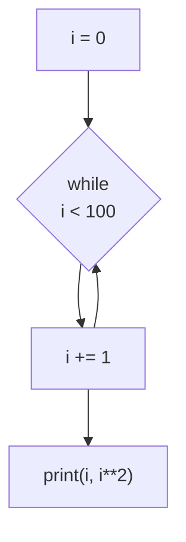
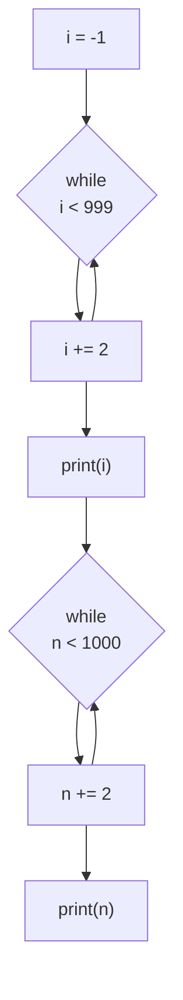
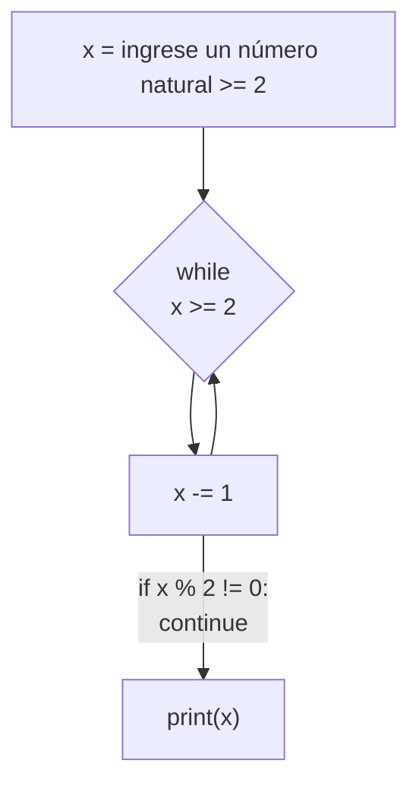

# reto-6
repositorio del reto # 6
1. Imprimir un listado con los números del 1 al 100 cada uno con su respectivo cuadrado.
```pseudocode
i = 0
while(i < 100):
    i += 1
    print(i,(i**2))
```


2. Imprimir un listado con los números impares desde 1 hasta 999 y seguidamente otro listado con los números pares desde 2 hasta 1000.
```pseudocode
i = -1
n = 0
while(i < 999):
  i += 2
  print(i)
while(n < 1000):
  n += 2
  print(n)
```



3. Imprimir los números pares en forma descendente hasta 2 que son menores o iguales a un número natural n ≥ 2 dado.
```pseudocode
x : int
x = int(input(" ingrese un número natural >= 2: "))
while(x >= 2):
  x -= 1
  if x % 2 != 0:
    continue
  print(x)
```


 


 


